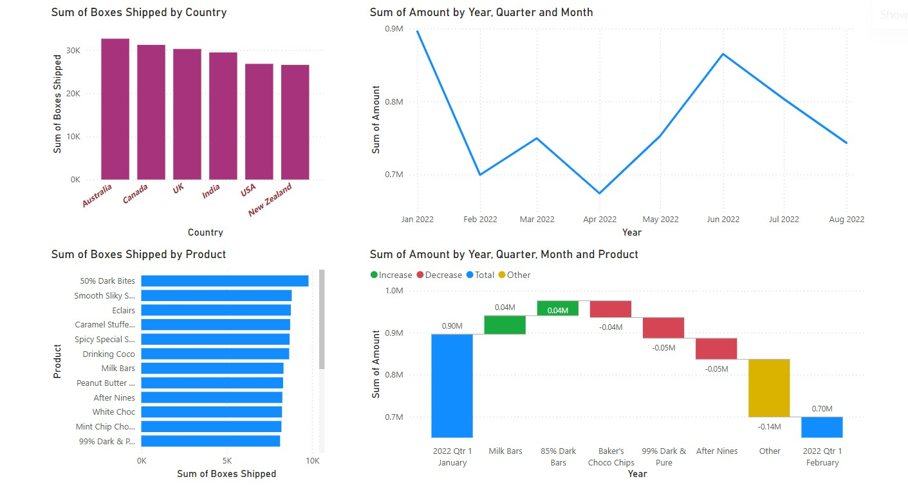

# 📊 Power BI Sales and Shipping Reports  

This repository contains **Power BI reports** that provide insights into **sales performance** and **shipping analysis**. These visualizations help analyze market trends, product sales, and shipment distribution.

 **Shipping Analysis Report**
  

#### 🔹 Key Insights:  
✔ **Boxes Shipped by Country**  
✔ **Shipped Amount Over Time**  
✔ **Most Shipped Products**  
✔ **Waterfall Analysis of Sales Changes**  

 ** Sales Performance Report**  
  

 🔹 Key Insights:  
✔ **Total Sales Overview**  
✔ **Sales by Market & Sub-Category**  
✔ **Monthly Sales Trend**  
✔ **Sales Returns Analysis**  

## 🚀 How to Use  
1. **Clone this repository**:   https://github.com/hasdit/POWERBI.DASBOARD.git
  
2. **Open the Power BI files** to explore interactive insights.
